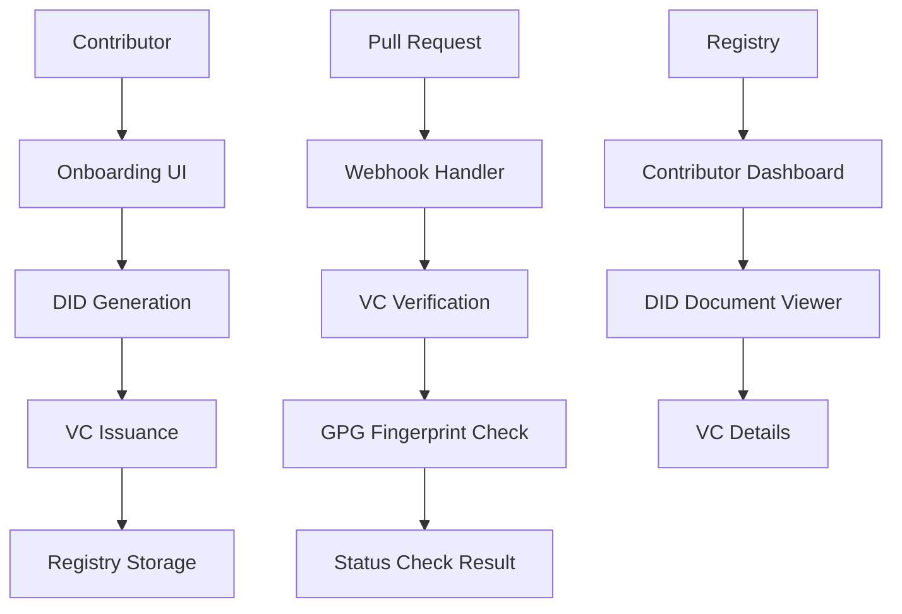

# GitVeritas

A full-stack prototype demonstrating Decentralized Identity (DIDs) and Verifiable Credentials (VCs) applied to open-source contributor verification, inspired by the Hiero Contributor Identity Verification project.

## Architecture



## Tech Stack

- **Backend**: Node.js + Express
- **Frontend**: React + TypeScript + Tailwind CSS
- **DID/VC**: local mock DID/VC issuance with did:key-style identifiers
- **GPG Simulation**: mock fingerprint generation
- **Storage**: persisted local JSON storage (`backend/db.json`)

## Features

### 1. Contributor Onboarding
- GitHub identity binding with username, optional GitHub ID, and profile URL
- Automatic DID generation (did:key-style)
- Verifiable Credential issuance and storage
- Persistent contributor storage in a local backend database

### 2. Contributor Registry
- List all onboarded contributors
- View DID Documents and VC details
- View GitHub binding metadata and trust chain details

### 3. PR Verification Simulator
- Mock PR verification by GitHub username and PR URL
- VC signature verification
- GPG fingerprint matching
- Optional Verifiable Presentation generation and verification
- GitHub webhook scaffold for pull request verification

### 4. Educational Explainer
- Step-by-step breakdown of DID/VC concepts
- Live examples with generated data
- Comparison: Old way (email) vs New way (DID+VC)

## Getting Started

### Prerequisites
- Node.js 18+
- npm or yarn

### Installation

1. **Backend Setup**:
   ```bash
   cd backend
   npm install
   npm run build
   npm start
   ```

2. **Frontend Setup**:
   ```bash
   cd frontend
   npm install
   npm start
   ```

3. **Access the Application**:
   - Frontend: http://localhost:3000
   - Backend API: http://localhost:3001

## API Endpoints

### Contributors
- `POST /api/contributors/onboard` - Onboard a new contributor with GitHub metadata
- `GET /api/registry/contributors` - List all contributors
- `GET /api/registry/contributors/:did` - Get contributor details

### Presentations
- `POST /api/presentations/create` - Create a mock verifiable presentation for a contributor
- `POST /api/presentations/verify` - Verify a presentation payload

### Verification
- `POST /api/verification/verify-pr` - Verify a pull request with VC, GPG signature, and optional presentation

### GitHub Integration
- `POST /api/github/webhook` - GitHub webhook scaffold for pull request events
- `POST /api/github/status` - Simulated status-check update endpoint

### DID Resolution
- `GET /api/did/:did` - Resolve a DID Document (mock)

## Key Concepts Demonstrated

### Decentralized Identifiers (DIDs)
- Self-sovereign identity control
- Cryptographically verifiable
- Portable across platforms

### Verifiable Credentials (VCs)
- Tamper-proof claims
- Issuer-signed credentials
- Subject-controlled presentation

### Trust Chain
1. **Issuer DID** creates and signs VC
2. **VC** contains verified claims about subject
3. **Subject DID** controls the identity

## Security Notes

⚠️ **This is a prototype for educational purposes only!**

- Private keys are still generated locally and should not be exposed in production
- Storage is persisted locally in `backend/db.json` but is not encrypted
- Verification logic is simplified and intended for demo purposes
- GitHub integration is scaffolded, not a production GitHub App
- GPG signatures and VPs are still mocked

## Future Enhancements

- [ ] Move from local JSON persistence to SQLite/PostgreSQL
- [ ] Real DID resolver integration
- [ ] VC expiry and revocation
- [ ] Full JWT-VP and linked presentation flow
- [ ] GitHub App integration with real webhook handling and status checks
- [ ] Heka Identity Platform / Hiero ecosystem integration
- [ ] Replace mock GPG and did:key-style identifiers with real DID methods

## License

MIT License - See LICENSE file for details.