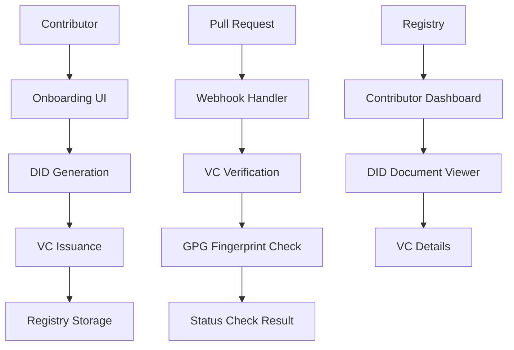

# GitVeritas

A full-stack prototype demonstrating Decentralized Identity (DIDs) and Verifiable Credentials (VCs) applied to open-source contributor verification, inspired by the Hiero Contributor Identity Verification project.

## Architecture



## Tech Stack

- **Backend**: Node.js + TypeScript + Express
- **Frontend**: React + TypeScript + Tailwind CSS
- **DID/VC**: did-jwt-vc library with did:key method
- **GPG Simulation**: tweetnacl for Ed25519 key generation
- **Storage**: In-memory (prototype)

## Features

### 1. Contributor Onboarding
- Mock GitHub OAuth (username input)
- Automatic DID generation (did:key)
- Ed25519 key pair generation for GPG simulation
- Verifiable Credential issuance and storage

### 2. Contributor Registry
- List all onboarded contributors
- View DID Documents and VC details
- Visualize trust chain (Issuer → VC → Contributor)

### 3. PR Verification Simulator
- Mock PR submission with GitHub username
- VC signature verification
- GPG fingerprint matching
- GitHub-style status check results

### 4. Educational Explainer
- Step-by-step breakdown of DID/VC concepts
- Live examples with generated data
- Comparison: Old way (email) vs New way (DID+VC)

## Getting Started

### Prerequisites
- Node.js 18+
- npm or yarn

### Installation

1. **Backend Setup**:
   ```bash
   cd backend
   npm install
   npm run build
   npm start
   ```

2. **Frontend Setup**:
   ```bash
   cd frontend
   npm install
   npm start
   ```

3. **Access the Application**:
   - Frontend: http://localhost:3000
   - Backend API: http://localhost:3001

## API Endpoints

### Contributors
- `POST /api/contributors/onboard` - Onboard a new contributor
- `GET /api/registry/contributors` - List all contributors
- `GET /api/registry/contributors/:did` - Get contributor details

### Verification
- `POST /api/verification/verify-pr` - Verify a pull request

### DID Resolution
- `GET /api/did/:did` - Resolve a DID Document (mock)

## Key Concepts Demonstrated

### Decentralized Identifiers (DIDs)
- Self-sovereign identity control
- Cryptographically verifiable
- Portable across platforms

### Verifiable Credentials (VCs)
- Tamper-proof claims
- Issuer-signed credentials
- Subject-controlled presentation

### Trust Chain
1. **Issuer DID** creates and signs VC
2. **VC** contains verified claims about subject
3. **Subject DID** controls the identity

## Security Notes

⚠️ **This is a prototype for educational purposes only!**

- Private keys are sent to frontend (never do this in production)
- In-memory storage (no persistence)
- Simplified verification logic
- Mock GPG signatures

## Future Enhancements

- [ ] SQLite/PostgreSQL persistence
- [ ] Real DID resolver integration
- [ ] VC expiry and revocation
- [ ] JWT-VP (Verifiable Presentations)
- [ ] Integration with real GitHub webhooks
- [ ] Hedera DID method instead of did:key

## License

MIT License - See LICENSE file for details.